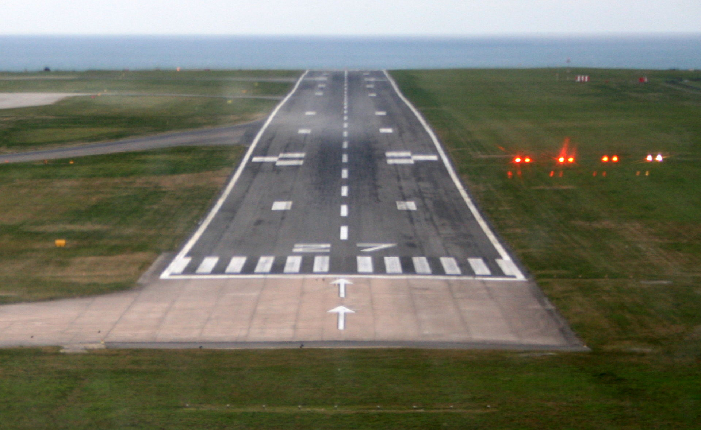

Precision Approach Path Indicator Quiz App
Udemy Kotlin for Android Course Exercise One

Pilots use a device called a 'Precision Approach Indicator' (PAPI) to provide a visual indication of their vertical position when approaching a runway for landins.

The PAPI uses four lights to display to the pilots in cockpit indications that the airplane is too low, to high, or on the correct glide path.

 
 
 This display indicates that the airplane is low relative to the correct glideslope.

